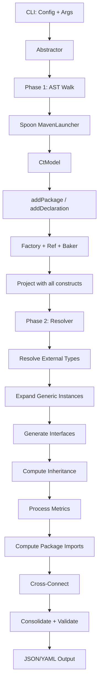

# Detailed Design: Java Abstractor Completion

## Overview

This document describes the design for completing the Java Abstractor so that
it can process all 31 projects in the Technical Debt Dataset (TDD) and produce
JSON/YAML output conforming to `genFeatureDef.md`. The output must be accurate
enough to produce meaningful participation/membership matrices for TD analysis.

The design builds on the existing codebase, preserving current patterns
(`Factory<T>`, `Ref<T>`, `Cmp`, `Jsonable`, `Logger`) while adding missing
functionality. The architecture follows the Go abstractor's two-phase approach:
**Phase 1** walks the Spoon AST and builds constructs; **Phase 2** post-processes
to resolve references, expand generics, generate interfaces, compute inheritance,
and validate.

## Detailed Requirements

Consolidated from requirements clarification (idea-honing.md):

1. **Success**: Run without crashing on all 31 TDD projects; output accurate
   enough for participation/membership matrices.
2. **External types**: Named stubs (not `Object`), flexible for future deep
   analysis.
3. **Target commits**: Latest commit per project with most complete SonarQube
   analysis in TDD.
4. **Error handling**: Log warnings and continue; never crash on unhandled
   constructs.
5. **Metrics**: Full set needed (codeCount, complexity, indents, lineCount,
   getter, setter, invokes, reads, writes).
6. **Annotations**: Use to inform analysis, skip as output constructs.
7. **Anonymous/lambdas**: Part of enclosing method; named nested classes are
   separate objects.
8. **Package imports**: Nice-to-have, lower priority.
9. **Generics**: Track concrete instantiations as distinct types.
10. **Testing**: Unit tests with expected YAML; manual scripts for TDD projects.
11. **Code quality**: Debuggable, readable, pragmatic research code.

## Architecture Overview



### Phase 1: AST Walk (Abstractor)

The existing `Abstractor` class handles Phase 1. Changes needed:

1. **Robustness in type dispatch** (`addTypeDesc`, `addDeclaration`)
2. **External type stubs** (new method + Baker extension)
3. **Enum completion** (enum values as package constants)
4. **Nested class tracking** (named inner classes with `nest` field)
5. **Anonymous/lambda folding** (metrics attributed to enclosing method)
6. **Value extraction** (package-level static fields and constants)
7. **Generic instantiation creation** (ObjectInst, MethodInst, InterfaceInst)

### Phase 2: Resolver (new)

A new `Resolver` class replaces the current `finish()` method with a structured
pipeline, modeled after the Go abstractor's resolver:

1. Resolve external type stubs
2. Expand generic instances (fixed-point loop)
3. Generate synthesized interfaces for objects
4. Compute inheritance (extends/implements chains)
5. Process all pending metrics
6. Compute package imports from type usage
7. Cross-connect constructs to packages
8. Consolidate duplicates
9. Validate

## Components and Interfaces

### Modified: Abstractor.java

#### Type Dispatch Robustness

The `addTypeDesc(CtTypeReference)` method needs a comprehensive dispatch chain
that handles all Spoon type reference cases without crashing:

```
addTypeDesc(tr):
  if tr == null             -> baker.objectDesc()
  if tr.isPrimitive()       -> addBasic(tr)
  if tr.isArray()           -> addArray(tr)
  if tr is CtWildcardRef    -> addWildcard(tr)

  ty = tr.getTypeDeclaration()   // use getTypeDeclaration, not getDeclaration
  if ty == null             -> addExternalStub(tr)
  if ty.isShadow()          -> addExternalStub(tr)
  if ty is CtAnnotationType -> skip, return baker.objectDesc()
  if ty is CtEnum           -> addEnum(ty)       // before CtClass check
  if ty is CtRecord         -> addObjectDecl(ty)  // CtRecord extends CtClass
  if ty is CtClass          -> check anonymous/local, then addObjectDecl(ty)
  if ty is CtInterface      -> addInterfaceDecl(ty)
  if ty is CtTypeParameter  -> addTypeParam(ty)
  else                      -> log warning, return baker.objectDesc()
```

Key changes:
- Use `getTypeDeclaration()` instead of `getDeclaration()` to get shadow types.
- Check `isShadow()` to route external types to stub creation.
- Handle `CtAnnotationType` by skipping (return `objectDesc()`).
- Handle `CtWildcardReference` (map to type param or interface desc bound).
- Check `isAnonymous()` / `isLocalType()` for anonymous class folding.
- Check `CtEnum` before `CtClass` (since `CtEnum extends CtClass`).

#### External Type Stubs

New method `addExternalStub(CtTypeReference)`:

```
addExternalStub(tr):
  qualifiedName = tr.getQualifiedName()
  
  // Check if it's a known basic type (String, boxed primitives)
  if isJavaBasicType(qualifiedName):
    return addBasic(unboxedName)
  
  // Create a stub interface declaration for the external type
  // This makes external types distinguishable in reads/writes/invocations
  return addExternalInterfaceDecl(qualifiedName, tr)
```

Java basic types to recognize: `java.lang.String` → basic `string`,
`java.lang.Integer` → basic `int`, `java.lang.Boolean` → basic `boolean`,
`java.lang.Character` → basic `char`, `java.lang.Long` → basic `long`,
`java.lang.Double` → basic `double`, `java.lang.Float` → basic `float`,
`java.lang.Byte` → basic `byte`, `java.lang.Short` → basic `short`.

For non-basic external types, create a stub `InterfaceDecl` in a synthetic
external package (e.g., package path = the external type's package name).
The stub has no abstracts or fields — just a name and package, making it
distinguishable in the output. If type arguments are present, create
`InterfaceInst` pointing to the stub declaration.

#### Anonymous/Lambda Handling

When `addTypeDesc` encounters an anonymous or local class:
- Do NOT create an `ObjectDecl` for it.
- Return the type of the interface/class it implements/extends.
- The metrics from its methods are captured by the enclosing method's
  `Analyzer` because Spoon's AST includes the anonymous class body as
  children of the enclosing method body.

For `CtLambda` in the Analyzer:
- Walk the lambda body as part of the enclosing method's element tree.
- Track reads/writes/invocations from the lambda as part of the enclosing
  method's metrics.

#### Named Nested Classes

When `addObjectDecl` detects `c.getRoleInParent() == CtRole.NESTED_TYPE`
and the class is NOT anonymous:
- Set `obj.nest` to the enclosing method or object instance.
- If the enclosing class is generic, carry its type parameters as
  implicit types.
- The nested class is added to the enclosing package (not a sub-package).

#### Value Extraction

New method `addValues(CtClass, PackageCon)`:

```
addValues(c, pkg):
  for each static field in c:
    if field is public/package-visible:
      create Value construct:
        name = field.getSimpleName()
        type = addTypeDesc(field.getType())
        const = field.isFinal()
        package = pkg
        loc = field location
      add to pkg.values
```

For enums, each enum constant becomes a `Value` with `const = true` and
type = the enum's object declaration.

#### Enum Handling

Extend `addEnum(CtEnum)`:
- Model the enum as an `ObjectDecl` (already partially done).
- The struct description contains a `$value` field (already done).
- Add each enum constant as a `Value` in the package.
- Add enum methods (like `values()`, `valueOf()`, and any user-defined methods).
- Connect super-interfaces (enums can implement interfaces).

### Modified: Baker.java

Extend the Baker with:

1. **External stub cache**: Map from qualified name to `Ref<InterfaceDecl>`
   for external type stubs.
2. **Boxing map**: Map from boxed type names to basic type names.
3. **Known JDK interfaces**: Optional lazy-created stubs for common types
   like `Iterable`, `Comparable`, `Collection`, `List`, `Map`, `Set`.

### New: Resolver.java

Replaces the current `Abstractor.finish()` with a structured pipeline:

```java
public class Resolver {
    private final Logger log;
    private final Project proj;

    public void resolve() throws Exception {
        this.expandGenericInstances();
        this.generateInterfaces();
        this.computeInheritance();
        this.processMetrics();
        this.computePackageImports();
        this.crossConnect();
        this.consolidate();
        this.validate();
    }
}
```

#### expandGenericInstances()

Fixed-point loop (modeled after Go's `instantiations.go`):

```
repeat until no changes:
  for each ObjectDecl with typeParams:
    for each usage site that provides concrete type args:
      create ObjectInst if not exists
      for each method on the object:
        create MethodInst with resolved signature
  for each InterfaceDecl with typeParams:
    for each usage site with concrete type args:
      create InterfaceInst if not exists
  for each MethodDecl with typeParams:
    for each call site with concrete type args:
      create MethodInst if not exists
```

Usage sites are found during Phase 1 by checking
`tr.getActualTypeArguments()` on parameterized type references.
When `addTypeDesc` encounters a parameterized reference to a generic
declaration, it creates the appropriate instance construct.

#### generateInterfaces()

For each `ObjectDecl` that doesn't yet have an `interface` field set:
- Collect all non-static, non-constructor methods.
- Create `Abstract` for each.
- Create `InterfaceDesc` with those abstracts.
- Set `pin` to the object declaration.
- Set `obj.interface` to the new description.

This is already partially done in `addObjectDecl` but should move to the
resolver to ensure all methods have been added first.

#### computeInheritance()

For each `InterfaceDesc`:
- For declared interfaces (`InterfaceDecl`): use Spoon's
  `i.getSuperInterfaces()` to populate `inherits`.
- For object synthesized interfaces: use Spoon's `c.getSuperInterfaces()`
  and `c.getSuperclass()` to populate `inherits`.
- Build inheritance forest (can use structural typing like Go, or explicit
  `extends`/`implements` from Java — start with explicit).

#### processMetrics()

Move from `Abstractor.processPendingMetrics()`. Enhancements:
- Complete `addAssignmentUsage`: Track writes to fields.
- Complete `addExecutableReferenceUsage`: Track method reference invocations.
- Handle `CtLambda` bodies: Walk as part of enclosing method.
- Handle `CtNewClass` (anonymous class) bodies: Walk as part of enclosing method.

#### computePackageImports()

Derive package imports from actual type usage rather than `import` statements:

```
for each package P:
  for each object/interface/method/value in P:
    for each type reference used:
      if the referenced type's package != P:
        add that package to P.imports
```

#### crossConnect()

Move from `Abstractor.crossConnectConstructs()`. Complete the TODO:
- Add methods to packages.
- Add interface declarations to packages.
- Add values to packages.
- Add object declarations to packages.

### Modified: Analyzer.java

#### Complete Usage Tracking

**addAssignmentUsage** (currently TODO):
```
addAssignmentUsage(assignment):
  LHS = assignment.getAssigned()
  if LHS is CtFieldWrite:
    field = LHS.getVariable().getFieldDeclaration()
    selection = abs.addSelection(field)
    this.writes.add(selection)
```

**addExecutableReferenceUsage** (currently TODO):
```
addExecutableReferenceUsage(er):
  executable = er.getDeclaration()
  if executable is CtMethod:
    ref = abs.addDeclaration(executable)
    this.invokes.add(ref)
```

#### Lambda/Anonymous Class Integration

When `addElement` encounters:
- `CtLambda`: Walk the lambda body/expression as children (already happens
  via `getDirectChildren()`, but ensure reads/writes/invocations are captured).
- `CtNewClass`: Walk the anonymous class body methods. Add their invocations,
  reads, writes to the enclosing method's metrics.

#### Cleanup

- Make `logElementTree` and `logUsage` configurable via constructor or
  controlled by `Config.verbose`.
- Remove hardcoded `true` values.

### Modified: Construct Classes

#### InterfaceDesc.java
- Ensure `pin` is set during interface generation.
- Ensure `inherits` is populated during inheritance computation.

#### ObjectDecl.java
- Add `nest` field support (already in `genFeatureDef.md` schema).
- Ensure `interface` is set during resolver's `generateInterfaces()`.

#### MethodDecl.java
- Add `isConstructor` boolean field.
- Set during `addConstructorMethod()`.
- Output in JSON if the `extra` flag is set (optional info).

#### Value.java
- Ensure `toJson` outputs: name, package, type, const, loc, metrics, vis.

### Modified: Config.java

No changes needed to the CLI interface. The existing flags (`-i`, `-o`, `-v`,
`-m`, `-e`) are sufficient.

## Data Models

### External Type Stubs

```mermaid
graph LR
    A[CtTypeReference to java.util.List] -->|getTypeDeclaration| B[Shadow CtClass]
    B -->|isShadow = true| C[addExternalStub]
    C --> D[InterfaceDecl: name=List, package=java.util]
    C --> E[InterfaceDesc: empty abstracts, pin=D]
    
    F[List<String> usage] -->|parameterized| G[InterfaceInst]
    G --> H[generic=D, instanceTypes=[basic:string]]
```

### Generic Instantiation Flow

```mermaid
graph TD
    A[CtClass HashMap<K,V>] --> B[ObjectDecl: HashMap]
    B --> C[typeParams: K, V]
    
    D[Usage: HashMap<String, User>] --> E[ObjectInst]
    E --> F[generic: HashMap]
    E --> G[instanceTypes: string, User]
    E --> H[resolvedData: StructDesc with concrete fields]
    E --> I[resolvedInterface: InterfaceDesc with concrete abstracts]
    
    J[Method get(K) in HashMap] --> K[MethodDecl: get]
    K --> L[MethodInst for HashMap<String,User>.get]
    L --> M[resolved: Signature(String) -> User]
```

### Metrics Data Flow

```mermaid
graph TD
    A[CtMethod body] --> B[Analyzer]
    B --> C[addElement tree walk]
    C --> D[Complexity: if/for/while/case/&&/||]
    C --> E[Line metrics: codeCount, lineCount, indents]
    C --> F[Accessor: getter/setter detection]
    C --> G[Usages]
    G --> H[CtInvocation -> invokes]
    G --> I[CtFieldRead -> reads via Selection]
    G --> J[CtFieldWrite/CtAssignment -> writes via Selection]
    G --> K[CtTypeAccess -> reads]
    G --> L[CtLambda body -> recurse into children]
    G --> M[CtNewClass body -> recurse into anonymous methods]
```

## Error Handling

All type dispatch and construct creation follows this pattern:

```java
try {
    // attempt to create/process the construct
} catch (Exception ex) {
    log.warning("Skipping <context>: " + ex.getMessage());
    return baker.objectDesc(); // or null, depending on context
}
```

- `addTypeDesc`: Returns `baker.objectDesc()` for any unhandled type.
- `addDeclaration`: Logs warning and returns null for unhandled declarations.
- `addMetrics`: Skips metrics for methods that cause errors.
- The `Validator` reports unresolved refs as warnings, not errors.

## Testing Strategy

### Unit Tests (testData/java/)

New test cases needed for each feature:

| Test | Feature | Input |
|------|---------|-------|
| test1004 | Enum with methods | Single file with enum |
| test1005 | Interface inheritance | Class implementing interfaces |
| test1006 | Generic class | Class with type parameters |
| test1007 | Generic instantiation | Usage of generic class with concrete types |
| test1008 | Nested named class | Outer class with inner class |
| test1009 | Anonymous class | Method with anonymous class, verify folding |
| test1010 | Lambda | Method with lambda, verify folding |
| test1011 | External type stubs | Code using java.util.List, String, etc. |
| test1012 | Values/constants | Static fields and constants |
| test1013 | Metrics reads/writes | Method with field reads and writes |
| test1014 | Super class | Class extending another class |

Each test has a `.java` source file and an `abstraction.yaml` expected output.

### Manual Validation Script

A shell script to run the abstractor against TDD projects:

```bash
#!/bin/bash
# run-tdd-projects.sh
PROJECTS="commons-cli commons-exec commons-dbutils"
for proj in $PROJECTS; do
  echo "Running abstractor on $proj..."
  java -jar target/abstractor-0.1-jar-with-dependencies.jar \
    -i /path/to/tdd/$proj -o output/$proj.json -v
  echo "Exit code: $?"
done
```

## Appendices

### A. Technology Choices

| Choice | Rationale |
|--------|-----------|
| Spoon 11.2.0 | Already in use, well-suited for Java analysis |
| Java 17 | Already in use, matches project setup |
| Custom JSON | Avoids YAML dependency, supports relaxed format for tests |
| Maven | Already in use for build |

### B. Research Findings Summary

- Go abstractor uses a clean two-phase architecture that the Java abstractor
  should mirror.
- Baker/innate `$`-prefix pattern is shared and should be extended for Java.
- Generic instantiation requires a fixed-point expansion loop.
- Metrics re-analysis for generic instances is needed.
- Structural interface generation from object methods is needed.
- Package imports can be derived from type usage.

### C. Alternative Approaches Considered

1. **Full JDK modeling**: Rejected for now. External types as stubs is simpler
   and the boundary is kept clean for later extension.
2. **Annotation types as interfaces**: Rejected. Annotations inform analysis
   but are not output constructs, keeping the feature definition
   language-agnostic.
3. **Anonymous classes as separate objects**: Rejected. They fold into the
   enclosing method for simpler membership tracking.
4. **ECJ instead of Spoon**: Not considered. Spoon is already working and
   provides a higher-level API.

### D. Key Constraints and Limitations

- The abstractor targets the 31 TDD Apache projects, not arbitrary Java code.
- Annotation-driven frameworks (Spring, Hibernate) may not be fully handled.
- Reflection-based patterns cannot be statically analyzed.
- Multi-module Maven projects may need special handling for MavenLauncher.
