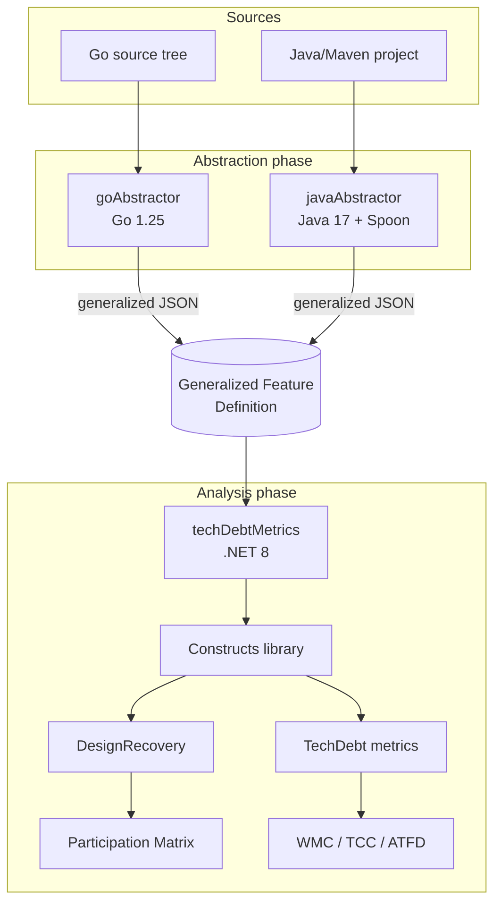
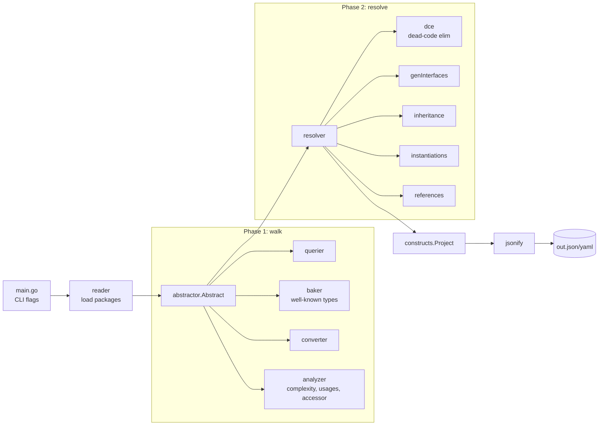
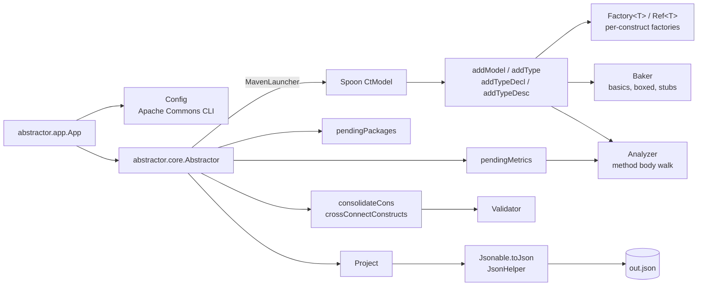
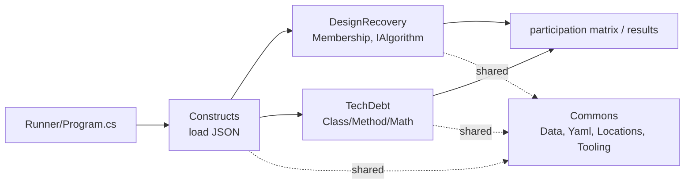

# Architecture

## System Architecture

The repository is a multi-language pipeline composed of three independent components that communicate via a shared JSON/YAML schema (the **Generalized Feature Definition**, `docs/genFeatureDef.md`).

Each abstractor is independently runnable and produces the same canonical output; the analysis side is language-agnostic because it loads the schema only.

## Architectural Style

- **Pipeline-of-tools**: components communicate through files (JSON/YAML), not in-process.
- **Schema-first**: the JSON schema (`docs/genFeatureDef.md`) is the contract. Adding a new construct requires changes in (a) at least one abstractor, (b) the schema doc, and (c) `techDebtMetrics/Constructs/`.
- **Two-phase abstraction**: each abstractor walks the AST, then post-processes (consolidate, cross-connect, validate; Go adds a full resolver). Java finish is on `Abstractor.performAbstraction` today; a dedicated `Resolver` is plan Step 8.
- **Mirror-but-don't-share**: Go and Java abstractors are written in their host languages and reuse patterns (Factory/Ref, Cmp, Jsonable, Logger) by convention rather than by code sharing.

## goAbstractor Architecture

Key packages under `goAbstractor/internal/`:

| Package | Responsibility |
| --- | --- |
| `abstractor` | Top-level orchestration: phase 1 walk + phase 2 resolve. |
| `abstractor/querier` | Wraps `golang.org/x/tools/go/packages` lookup helpers. |
| `abstractor/baker` | Pre-builds well-known types (basics, builtin interfaces). |
| `abstractor/converter` | Turns `go/types` into construct references. |
| `abstractor/analyzer` | Per-method analysis: cyclomatic complexity, reads/writes/invokes, accessor detection. |
| `abstractor/instantiator` | Generic instantiation tracking. |
| `abstractor/resolver` | Phase-2 passes: DCE, generated interfaces, inheritance, instantiations, references. |
| `constructs` | Construct types (one folder per kind), factories, project root. |
| `jsonify` | JSON tree builder + minimization. |
| `logger` | Push/pop indented logger. |
| `locs` | File/line location set. |
| `assert`, `debug`, `stringer` | Internal utilities. |

## javaAbstractor Architecture

Key packages under `javaAbstractor/src/main/java/abstractor/`:

| Package | Responsibility |
| --- | --- |
| `app` | CLI entrypoint (`App`) and argument parsing (`Config`). |
| `core` | `Abstractor` (walk + finish), `Analyzer` (method bodies). |
| `core.spoonUtils` | `SpoonUtils` helpers for Spoon elements and packages. |
| `core.constructs` | Construct classes; `Factory<T>` / `Ref<T>`; `Baker` (`anyDesc`, arrays, boxing). |
| `core.validator` | `Validator` post-walk checks. |
| `core.json` | JSON tree, formatter, parser, `JsonHelper` writer config. |
| `core.cmp` | Comparison utilities (`Cmp`, `CmpOptions`). |
| `core.iter` | Iterator helpers. |
| `core.diff` | Diff utilities (Hirschberg, Wagner) used by tests. |
| `core.log` | `Logger` (mirrors Go's). |
| `core.validator` | Post-walk validation pass. |

Java: walk plus inline finish (no `Resolver` class yet). Anonymous/local types are not emitted as declarations (`addTypeDesc` returns null); metrics folding for their bodies is plan Step 4. Named nested classes use `$nest` on structs; schema `nest` on `ObjectDecl` is plan Step 3. Interface `inherits` is populated during the walk.

## techDebtMetrics Architecture

Projects in the .NET solution (`techDebtMetrics/techDebtMetrics.sln`):

| Project | Role |
| --- | --- |
| `Commons` | YAML/data tooling, location reader, shared extensions. |
| `Constructs` | One `.cs` per construct kind, mirroring `genFeatureDef.md`. Loads abstractor output. |
| `DesignRecovery` | Design recovery / membership / participation algorithms. |
| `TechDebt` | TD metric computation (`Class.cs`, `Method.cs`, `Math.cs`, `Validator.cs`). |
| `Runner` | CLI driver. Currently a stub (`throw new NotImplementedException`). |
| `UnitTests` | xUnit-style test project with `CommonsTests` and `ConstructTests`. |

## Cross-Cutting Concerns

- **Error handling**: log warnings and continue rather than crash; TD analysis tolerates imprecision (see `AGENTS.md`).
- **Logging**: indented push/pop logger in both abstractors. The Go logger is `goAbstractor/internal/logger`; the Java mirror is `abstractor.core.log`.
- **Locations**: source-position tracking is part of the schema (Go: `internal/locs/`; Java: `core.constructs.Location`/`Locations`; .NET: `Commons.Data.Locations`).
- **Comparison/equality**: `Cmp`/`CmpOptions` pattern in both abstractors, used for deduplication and stable ordering.
- **External types** (Java): boxed primitives and `String` → `Baker.basicForBoxedOrString`. Other shadow references currently → `anyDesc`; named stub `InterfaceDecl`s are the target (plan Step 5).
