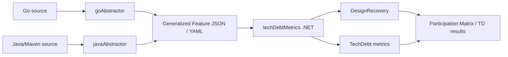

# Codebase Information

> Snapshot generated by the `codebase-summary` SOP. Treat as a navigation aid; consult source for ground truth.

## Identity

- **Repository**: `MSUSEL/msusel-tdmetrics-go`
- **Purpose**: Pipeline for technical-debt analysis of procedural and object-oriented languages, supporting PhD research at Montana State University's Software Engineering and Cybersecurity Laboratory (MSU SECL).
- **Status**: Active research tool, finite lifetime. Not a production product.
- **License**: See `LICENSE` at repo root.

## High-Level Pipeline

The shared interchange format is documented in `docs/genFeatureDef.md`. Both abstractors emit it; `techDebtMetrics` consumes it.

## Top-Level Layout

| Path | Role |
| --- | --- |
| `goAbstractor/` | Go source → generalized JSON. Go 1.25 module. Entry: `main.go`. |
| `javaAbstractor/` | Java/Maven source → generalized JSON. Java 17, Maven, Spoon 11.2.0. Entry: `abstractor.app.App`. |
| `techDebtMetrics/` | .NET 8 solution that loads JSON, runs Design Recovery and TD metrics. Entry: `Runner/Program.cs`. |
| `docs/` | Schema (`genFeatureDef.md`), pipeline diagram, design notes (`spoonNotes.md`, `ducktype.md`, …). |
| `testData/go/`, `testData/java/` | Integration-test fixtures: small projects with expected `abstraction.yaml`. |
| `.agents/planning/` | Multi-step plans for ongoing work (currently the Java Abstractor Completion plan). |
| `.agents/summary/` | This generated documentation set. |
| `.cursor/rules/` | Cursor agent rules (e.g. `java-abstractor-handoff.mdc`). |
| `.cursor/commands/` | SOP commands available in Cursor (`codebase-summary.sop.md`, `pdd.sop.md`, …). |
| `.github/workflows/ci.yaml` | CI: Go (Linux/Win/macOS) tests + lint, Java tests on Linux, .NET tests. |
| `Makefile` | Convenience targets: `test`, `clean`, plus per-component variants. |
| `AGENTS.md` | Researcher-authored guidelines for AI agents working in this repo. |

## Languages and Tooling

| Component | Language | Build | Test | Notable Dependencies |
| --- | --- | --- | --- | --- |
| `goAbstractor` | Go 1.25 | `go build`, `go run main.go` | `go test ./...` | `golang.org/x/tools` (packages/types), `Snow-Gremlin/goToolbox`, `gopkg.in/yaml.v3` |
| `javaAbstractor` | Java 17 | `mvn clean compile assembly:single` | `mvn test` (JUnit 5) | Spoon 11.2.0 (`fr.inria.gforge.spoon:spoon-core`), Apache Commons CLI 1.9.0 |
| `techDebtMetrics` | C# / .NET 8 | `dotnet build` | `dotnet test` | (see `techDebtMetrics/*.csproj`) |

CI matrix in `.github/workflows/ci.yaml` runs Go tests on Linux/Windows/macOS, lints Go with `golangci-lint`, runs `mvn test` and `dotnet test` on Linux.

## Design Conventions Shared Across Abstractors

The Java abstractor loosely mirrors the Go abstractor (the older, more complete one) for cross-codebase maintainability:

- **Factory + Ref pattern**: `Factory<T>` / `Ref<T>` (Java); analogous factories in `goAbstractor/internal/constructs/*` (Go).
- **Comparison**: `Cmp` / `CmpOptions` types for ordering and equality of constructs.
- **JSON output**: `Jsonable` interface with `toJson(JsonHelper)` (Java); `Jsonify` package in Go (`internal/jsonify/`).
- **Logging**: `Logger` with push/pop indentation in both languages.
- **Two-phase architecture**: AST walk to populate constructs, then a resolver/post-processing phase. Go has this fully (`internal/abstractor/resolver/`); Java is on its way (Step 12 of the plan).

## Output Schema (Generalized Feature Definition)

Defined in `docs/genFeatureDef.md`. Top-level constructs include:
`Project`, `Package`, `Abstract`, `Argument`, `Basic`, `Field`,
`InterfaceDecl`, `InterfaceDesc`, `InterfaceInst`,
`Method`, `MethodInst`, `Metrics`, `Object`, `ObjectInst`,
`Selection`, `Signature`, `StructDesc`, `TypeParam`, `Value`.

The `techDebtMetrics/Constructs/` C# project is a one-to-one consumer of these constructs (one `.cs` per construct kind).

## Current Research Status

- The active workstream is **completing the Java abstractor** so it can process all 31 Apache Java projects in the Technical Debt Dataset (TDD) (`javaAbstractor/tdd/td_V2.db`, SQLite).
- Plan: `.agents/planning/2026-05-01-java-abstractor-completion/implementation/plan.md` — 15 steps; **Steps 1–2 complete**; **Step 3 (enum completion) is next**.
- Summary / handoff: `.agents/planning/2026-05-01-java-abstractor-completion/summary.md` and `.cursor/rules/java-abstractor-handoff.mdc`.
