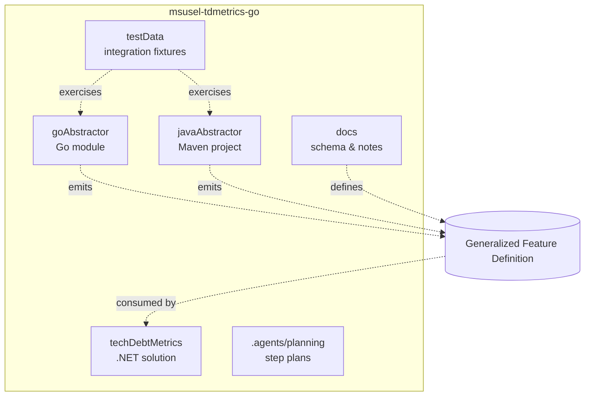

# Components

This document enumerates the major components, their entry points, and their responsibilities. For higher-level relationships, see `architecture.md`.

## Component Map

## goAbstractor

- **Entry point**: `goAbstractor/main.go` (CLI flags `-i`, `-o`, `-v`, `-m`, `-h`).
- **Library entry**: `internal/abstractor.Abstract(Config) constructs.Project`.
- **Output**: JSON tree built by `internal/jsonify`, optionally minimized.

### Sub-packages (selected)

| Package | Files of interest | Responsibility |
| --- | --- | --- |
| `internal/abstractor` | `abstractor.go` | Phase-1 walk over `golang.org/x/tools/go/packages` results. |
| `internal/abstractor/analyzer` | `analyzer.go`, `complexity/`, `usages/`, `accessor/` | Per-method analysis (cyclomatic complexity, reads/writes/invokes, accessor detection). |
| `internal/abstractor/baker` | `baker.go` | Pre-bakes well-known/basic types so they're shared across constructs. |
| `internal/abstractor/converter` | `converter.go` | Maps `go/types` to construct references. |
| `internal/abstractor/instantiator` | `instantiator.go` | Generic instantiation creation. |
| `internal/abstractor/querier` | `querier.go` | Wrapper around the Go `packages` loader. |
| `internal/abstractor/resolver` | `resolver.go`, `dce/`, `genInterfaces/`, `inheritance/`, `instantiations/`, `references/` | Phase-2 resolver passes. |
| `internal/constructs` | one folder + `.go` per construct kind, plus `factory.go`, `project/`, `packageCon/` | Construct types and factories. |
| `internal/jsonify` | – | JSON tree, minimize/format. |
| `internal/logger` | – | Indented logger. |
| `internal/locs` | – | File/line location set built on `go/token.FileSet`. |
| `internal/reader` | – | High-level "read packages" helper used by `main.go`. |
| `internal/assert`, `internal/debug`, `internal/stringer` | – | Internal helpers. |

### Tests

- `goAbstractor/tests/tests_test.go`, `tool_test.go` — integration runner over `testData/go/test*` fixtures.
- Per-package `*_test.go` files (e.g. `analyzer_test.go`).

## javaAbstractor

- **Entry point**: `abstractor.app.App.main` (Maven assembly produces `target/abstractor-0.1-jar-with-dependencies.jar`).
- **Library entry**: `new Abstractor(log, project).addMavenProject(path)` then `proj.toJson(JsonHelper)`.
- **Parser**: Spoon 11.2.0 via `MavenLauncher`.

### Sub-packages

| Package | Key classes | Responsibility |
| --- | --- | --- |
| `abstractor.app` | `App`, `Config` | CLI entrypoint and argument parsing (Apache Commons CLI). |
| `abstractor.core` | `Abstractor`, `Analyzer` | Spoon AST walk and per-method analysis. |
| `abstractor.core.constructs` | `Project`, `PackageCon`, `Factory`, `Ref`, `Baker`, plus one class per construct kind (`Abstract`, `Argument`, `Basic`, `Field`, `InterfaceDecl/Desc/Inst`, `Method/Decl/Inst`, `Metrics`, `ObjectDecl/Inst`, `Selection`, `Signature`, `StructDesc`, `TypeParam`, `Value`, `Location/Locations`) | Construct types and factories. Mirrors `genFeatureDef.md`. |
| `abstractor.core.json` | `JsonHelper`, `JsonNode`, `JsonFormat`, `parser/` | JSON output (build, parse, format with optional minimization). |
| `abstractor.core.cmp` | `Cmp`, `CmpOptions` | Stable ordering and equality across constructs. |
| `abstractor.core.iter` | – | Iterator helpers used widely. |
| `abstractor.core.diff` | `core/`, `hirschberg/`, `wagner/`, `comparators/` | Diff algorithms (used by tests for YAML golden comparisons). |
| `abstractor.core.log` | `Logger` | Indented logger mirroring the Go side. |
| `abstractor.core.validator` | `Validator` | Post-walk sanity checks on the project graph. |

### Notable state on `Abstractor`

- `pendingMetrics: HashSet<CtMethod<?>>` — methods queued for body analysis. `processPendingMetrics` drains in batches (copy + clear + process) to avoid `ConcurrentModificationException` when metrics walk discovers more methods.
- `externalInterfaceStubByErasure: HashMap<String, Ref<InterfaceDecl>>` — cache of external/JDK stub `InterfaceDecl`s keyed by erasure-qualified name. Used by `addExternalStub`.

### Tests (`javaAbstractor/src/test/java/abstractor/`)

| Class | Purpose |
| --- | --- |
| `AppTests` | End-to-end runs of `testData/java/test*` fixtures vs `abstraction.yaml` goldens. |
| `core.Tester` | Shared test harness for single-file fixtures. |
| `core.RobustnessTests` | Step-1 regressions (wildcards, anonymous, annotations, lower-bounded wildcards). |
| `core.MetricsTests` | Method-level metric assertions (currently being stabilized). |
| `core.JsonTests` | JSON build/parse round-trips. |
| `core.DiffTests`, `core.IterTests` | Utilities. |

## techDebtMetrics

.NET 8 solution at `techDebtMetrics/techDebtMetrics.sln`.

| Project | Path | Role |
| --- | --- | --- |
| `Commons` | `Commons/` | `Data/Yaml/`, `Data/Locations/`, `Extensions/GeneralExt.cs`, `Tooling/TestHook.cs`. Shared utilities. |
| `Constructs` | `Constructs/` | One `.cs` file per schema construct (`Project.cs`, `Package.cs`, `ObjectDecl.cs`, `InterfaceDecl.cs`, `Method*.cs`, …). Loads/holds the abstractor output. Includes `IConstruct`, `IDeclaration`, `IInterface`, `IMethod`, `IObject`, `ITypeDesc` interfaces. |
| `DesignRecovery` | `DesignRecovery/` | `DesignRecovery.cs`, `IAlgorithm.cs`, `Manager.cs`, `Membership.cs`, `TestHook.cs`. Currently the participation/membership computation is mostly commented out (TODO: synthesised object for basics and projects). |
| `TechDebt` | `TechDebt/` | `Class.cs`, `Method.cs`, `Math.cs`, `Participation.cs`, `Project.cs`, `Source.cs`, `Validator.cs`. Computes WMC/TCC/ATFD-style metrics. |
| `Runner` | `Runner/Program.cs` | CLI driver. **Currently stubbed** (`throw new NotImplementedException`). |
| `UnitTests` | `UnitTests/` | `CommonsTests/{ExtensionsTests,LocationsTests}.cs`, `ConstructTests/ConstructTests.cs`. |

## Test Fixtures (`testData/`)

- `testData/go/test0001` … `test0018` — Go projects, each with `main.go` and `abstraction.yaml` (and sometimes `expStub.txt`).
- `testData/java/test0001`, `test0002`, `test1001`–`test1005` — Java fixtures; `test10NN` are single-file Tester fixtures used by Step-1/Step-2 work, while lower numbers are full Maven projects exercised by `AppTests`.
- `testData/todo.md` — running list of fixtures-to-add.

## Documentation (`docs/`)

| File | Content |
| --- | --- |
| `genFeatureDef.md` | The canonical schema for the JSON interchange format. |
| `pipelineDiagram.svg` | The pipeline figure used in the top-level README. |
| `ducktype.md` | Notes on representing Go duck typing. |
| `extendingPointers.md` | Pointer extension rationale (Go). |
| `participationMatrix.md` | Participation-matrix definition. |
| `spoonNotes.md` | Spoon API gotchas relevant to the Java abstractor. |
| `tdResults.md` | Notes on TD analysis results. |
| `CompPaper.pdf` | Reference paper. |

## Planning and Agent Context

- `.agents/planning/2026-05-01-java-abstractor-completion/` — current 15-step plan with `rough-idea.md`, `idea-honing.md`, `design/`, `research/`, `implementation/plan.md`, `summary.md`.
- `.cursor/rules/java-abstractor-handoff.mdc` — concise handoff rule loaded by Cursor when editing Java abstractor files.
- `.cursor/commands/*.sop.md` — workflow SOP commands available in Cursor (`code-assist`, `code-task-generator`, `codebase-summary`, `eval`, `pdd`).
- `AGENTS.md` — researcher's binding rules for AI agents (git restrictions, plan-first workflow, code quality).
