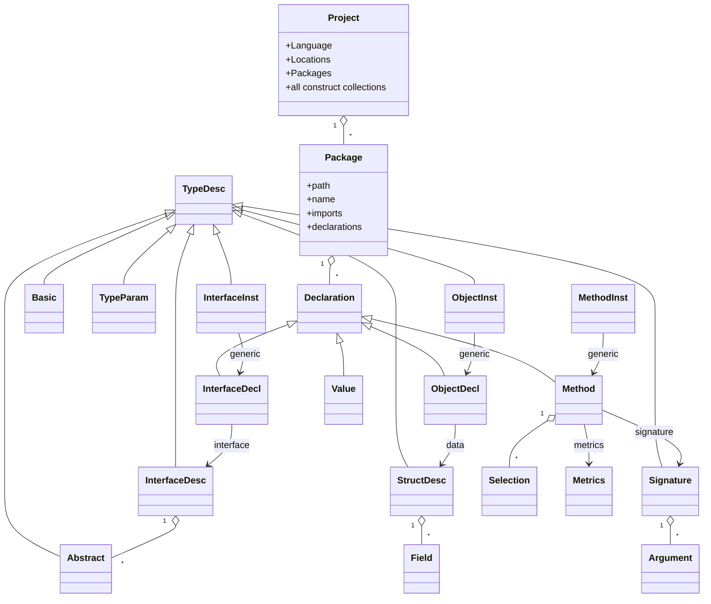

# Data Models

The central data model is the **Generalized Feature Definition** schema (`docs/genFeatureDef.md`). All three components (`goAbstractor`, `javaAbstractor`, `techDebtMetrics`) materialize the same conceptual model in their host language.

## Construct Hierarchy

## Construct Categories

Per `docs/genFeatureDef.md`:

- **Declarations** (named, package-owned): `InterfaceDecl`, `ObjectDecl`, `Method`, `Value`.
- **Type Descriptions** (anything usable in a parameter slot): `Basic`, `InterfaceDesc`, `StructDesc`, `Signature`, `TypeParam`, `Abstract`, `InterfaceInst`, `ObjectInst`, plus `MethodInst` for generic methods.
- **Members**: `Field` (in `StructDesc`), `Argument` (in `Signature`), `Selection` (member access in method bodies), `Abstract` (interface method/property entry).
- **Annotations / metrics**: `Metrics` (cyclomatic complexity, reads/writes/invokes counts, line counts), `Locations` (file+line ranges).

## Per-Language Materialization

| Concept | Go (`goAbstractor/internal/constructs`) | Java (`abstractor.core.constructs`) | .NET (`techDebtMetrics/Constructs`) |
| --- | --- | --- | --- |
| `Project` | `project/` package, `project.New(locs)` | `Project` class | `Project.cs` |
| Construct interface | `constructs.go` (`Construct`) | `Construct` / `ConstructImp` | `IConstruct.cs` |
| Declarations | `declaration.go` (`Declaration`) | `Declaration` / `DeclarationImp` / `TypeDeclaration` | `IDeclaration.cs` |
| Factories | `factory.go` per construct | `Factory<T>` + `Ref<T>` | (constructed during JSON load) |
| `Basic` | `basic/` + `basic.go` | `Basic.java` | `Basic.cs` |
| `InterfaceDecl/Desc/Inst` | `interfaceDecl*`, `interfaceDesc*`, `interfaceInst*` | same names | same names |
| `Method/Inst` | `method/`, `methodInst/` | `Method`, `MethodDecl`, `MethodInst` | `MethodDecl.cs`, `MethodInst.cs` |
| `Object/Inst` | `object/`, `objectInst/` | `ObjectDecl`, `ObjectInst` | `ObjectDecl.cs`, `ObjectInst.cs` |
| `Metrics` | `metrics/` | `Metrics` | `Metrics.cs` |
| `Locations` | `internal/locs/` | `Location`, `Locations` | `Commons/Data/Locations/` |

The Go side has additional **temporary/reference constructs** used during the resolver phase: `tempReference`, `tempDeclRef`, `tempTypeParamRef`. These are placeholders that get rewritten when the resolver wires up cross-references; they do not appear in finished JSON.

## Generic Instantiation Model

Generics produce three distinct **instance** constructs:

- `InterfaceInst` — instantiation of a generic interface (e.g. `Comparable<String>`).
- `ObjectInst` — instantiation of a generic class/struct.
- `MethodInst` — instantiation of a generic method.

In the Java abstractor, Baker provides generic **`$Array`** / `InterfaceInst` for array types. User-side and JDK **`ObjectInst` / `MethodInst`** population is in progress (plan Step 7).

## External / Stub Types (Java)

JDK and library types outside the analyzed compilation unit:

- **Boxed primitives + `String`** → shared `Basic` via `Baker.basicForBoxedOrString`.
- **Shadow types (today)** → `Abstractor.addShadowTypeDesc` returns `Baker.anyDesc()`.
- **Target** → named stub `InterfaceDecl` per erasure-qualified name; parameterized refs → `InterfaceInst` (plan Step 5).

Arrays use Baker’s synthetic `$Array` declaration, not JDK `java.lang` stubs.

## TDD Database (input metadata)

`javaAbstractor/tdd/td_V2.db` (SQLite) enumerates 31 Apache Java projects for end-to-end validation (plan Step 11). Schema: `research/td-dataset.md`.

## Output Formats

- **JSON** (canonical) — emitted directly by both abstractors.
- **YAML** — used as the test-golden format (`testData/*/abstraction.yaml`). Go uses `gopkg.in/yaml.v3`; Java uses its own diff utilities (`abstractor.core.diff`) when comparing output to goldens; .NET uses `Commons/Data/Yaml/`.
- **Minimization** — both abstractors expose a `--minimize`/`-m` flag that selects a compact format.
