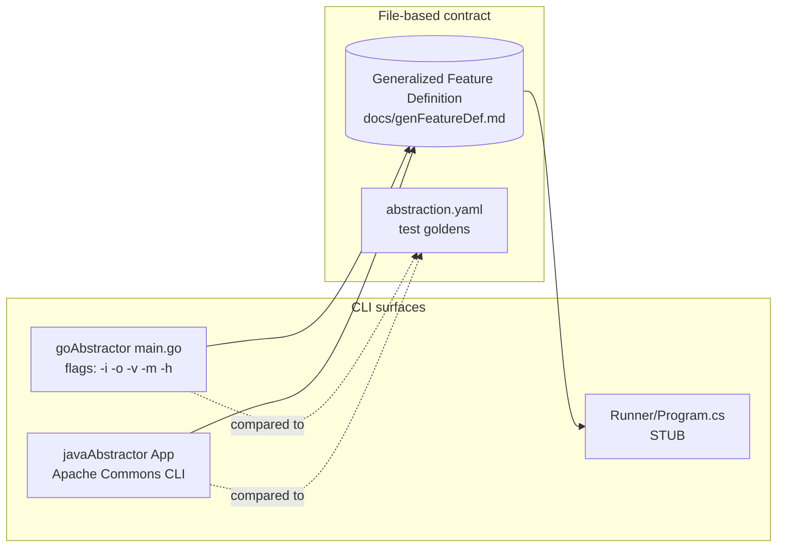

# Interfaces and Integration Points

The components in this repo integrate primarily through **files** (the JSON/YAML schema) rather than in-process APIs. This document catalogs the integration surfaces.

## Integration Surfaces



## CLI Interfaces

### goAbstractor

Defined in `goAbstractor/main.go` via `argObject`:

| Flag | Purpose |
| --- | --- |
| `-h`, `--help` | Print help. |
| `-v`, `--verbose` | Verbose status output. |
| `-m`, `--minimize` | Minimize JSON output. |
| `-i`, `--in` | Input path (Go module/package). |
| `-o`, `--out` | Output JSON path. |

Run example: `go run ./main.go -i <module path> -o out.json`.

### javaAbstractor

Defined in `abstractor.app.Config` (uses `commons-cli`). Exact flags are parsed by `Config.FromArgs(args, null)` in `App.java`. Notable runtime fields used by `App`:

- `cfg.input` — Maven project path (`Abstractor.prepareMavenProject`).
- `cfg.output` — output JSON path (stdout if null).
- `cfg.minimize` — toggles `JsonFormat.Minimize()` vs `cfg.defaultFormat`.
- `cfg.writeKinds`, `cfg.writeIndices`, `cfg.writeRefs` — JSON verbosity toggles wired into `JsonHelper`.
- `cfg.verbose`, `cfg.logOut`, `cfg.logErr` — logger configuration.

Run example after `mvn clean compile assembly:single`:
`java -jar target/abstractor-0.1-jar-with-dependencies.jar -i <maven proj> -o out.json`.

### techDebtMetrics Runner

`techDebtMetrics/Runner/Program.cs` is currently a stub:

```20:30:techDebtMetrics/Runner/Program.cs
internal class Program {
    static void Main(string[] args) {
        Console.WriteLine("Hello from Runner: [" + string.Join(", ", args) + "]");
        throw new NotImplementedException(nameof(Program));
    }
}
```

The intended invocation is `dotnet run --project Runner` (per `techDebtMetrics/README.md`). Wiring up the runner is downstream of finishing the Java abstractor.

## File Format: Generalized Feature Definition

The canonical contract is `docs/genFeatureDef.md`. It defines:

- **Constructs**: `Abstract`, `Argument`, `Basic`, `Field`, `InterfaceDecl`, `InterfaceDesc`, `InterfaceInst`, `Method`, `MethodInst`, `Metrics`, `Object`, `ObjectInst`, `Package`, `Project`, `Selection`, `Signature`, `StructDesc`, `TypeParam`, `Value`.
- **Type descriptions** (subset of constructs): things usable as a value type (e.g. `Basic`, `InterfaceDesc`, `StructDesc`, `Signature`, `TypeParam`, instantiations).
- **Declarations**: top-level named entities owned by a `Package` (e.g. `Method`, `ObjectDecl`, `InterfaceDecl`, `Value`).
- **Indices, keys, extra info**: flags on `JsonHelper` toggle whether kinds/indices/refs are written, supporting both compact and richly-annotated output.

The C# `Constructs` project (`techDebtMetrics/Constructs/`) is a one-to-one consumer: each construct in the schema has a corresponding `.cs` class.

## In-Process APIs (per component)

### goAbstractor

- `internal/abstractor.Abstract(cfg Config) constructs.Project` — top-level pipeline.
- `internal/constructs/factory.go` — generic factory pattern; each construct kind exposes a `New…` factory.
- `internal/jsonify` — JSON tree builder consumed by `main.go`.
- `internal/logger.Logger` — `Log`, push/pop indentation.

### javaAbstractor

- `abstractor.core.Abstractor` — `prepareMavenProject`, `prepareClassesFromSource`, `performAbstraction()`.
- `abstractor.core.constructs.Project.toJson(JsonHelper)` — emits the JSON tree.
- `abstractor.core.constructs.Factory<T>` + `Ref<T>` — factory/lazy-resolution (mirrors Go).
- `abstractor.core.constructs.Baker` — `anyDesc`, `$Array`, `basicForBoxedOrString`.
- `abstractor.core.validator.Validator` — post-walk validation.
- `abstractor.core.log.Logger` — `error`, `notice`, `warn`, push/pop indentation.

### techDebtMetrics

- `Constructs.Project` — root object, exposes `IReadOnlyList<...>` for every construct kind. Implements `IConstruct` and `IKeyResolver`.
- `Constructs.IConstruct`, `IDeclaration`, `IInterface`, `IMethod`, `IObject`, `ITypeDesc` — small interface set used by analysis code.
- `DesignRecovery.DesignRecovery(Project)` — analysis entry (currently mostly commented out).
- `TechDebt.*` — TD metric computations (`Class`, `Method`, `Math`, `Participation`, `Validator`).

## External Dependencies as Integration Points

| Component | External | Surface |
| --- | --- | --- |
| `goAbstractor` | `golang.org/x/tools/go/packages` | Loads Go packages and `go/types` info. |
| `goAbstractor` | `github.com/Snow-Gremlin/goToolbox` | CLI args (`argers/args`), general utilities. |
| `goAbstractor` | `gopkg.in/yaml.v3` | YAML output (used by tests and golden comparisons). |
| `javaAbstractor` | `fr.inria.gforge.spoon:spoon-core:11.2.0` | AST model (`CtModel`, `CtType`, `CtTypeReference`, `CtMethod`, …). |
| `javaAbstractor` | `commons-cli:1.9.0` | CLI argument parsing. |
| `techDebtMetrics` | .NET 8 BCL | – |

## CI Integration

`.github/workflows/ci.yaml` defines the cross-component verification:

- **goAbstractor** tests on Linux/Windows/macOS (`go test -cover ./...`).
- **goAbstractor** lint via `golangci/golangci-lint-action@v8`.
- **javaAbstractor** tests on Linux (`mvn test`, JDK 17 Temurin).
- **techDebtMetrics** tests via `dotnet test` (matrix continues beyond the snippet inspected; see file).

The `Makefile` mirrors these locally: `make test` (== `go-test j-test td-test`).
