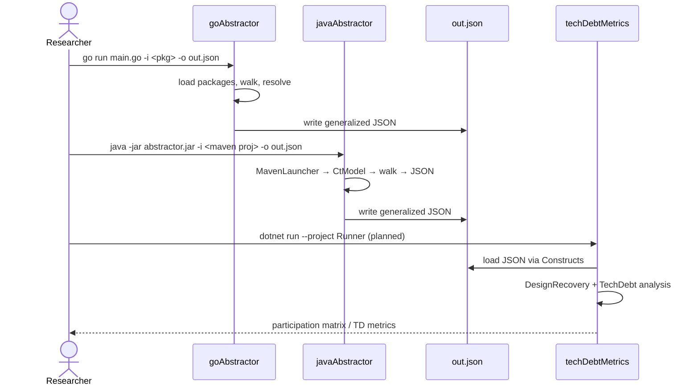
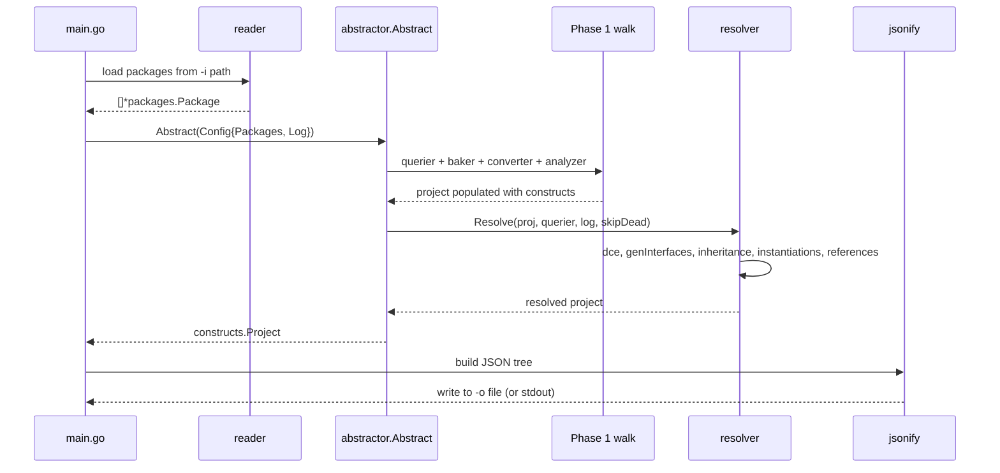
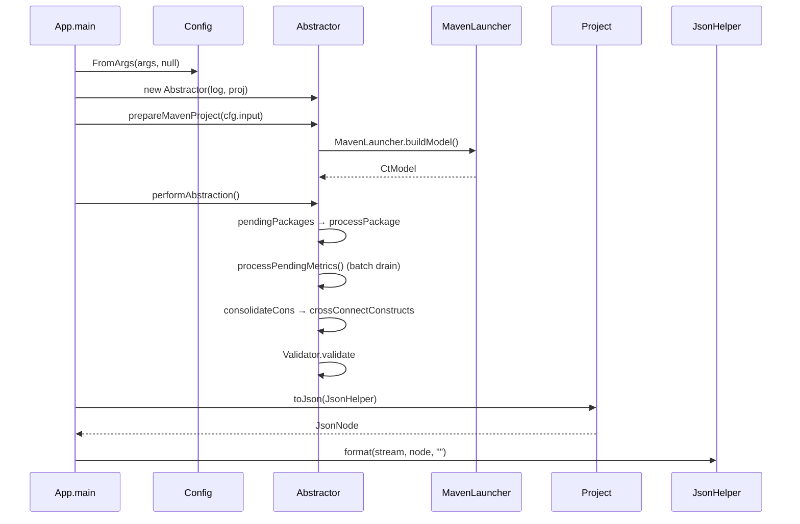
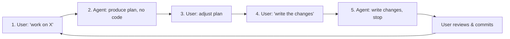

# Workflows

This document captures the key runtime and developer workflows.

## End-to-End Pipeline

The .NET runner is currently stubbed; the analysis pipeline is exercised via `UnitTests` in the meantime.

## goAbstractor — Internal Flow

## javaAbstractor — Internal Flow

Notable details:

- `addTypeDesc` uses `getTypeDeclaration()`; anonymous/local types return `null` (notice); `<nulltype>` → `anyDesc`.
- Wildcards map to bounds or `anyDesc` when unbounded (`Object` bound treated as unbounded).
- Boxed / `String` → `Baker.basicForBoxedOrString`; **`tr.isShadow()`** → `addShadowTypeDesc` → **`anyDesc`** (stubs planned).
- `InterfaceDesc.inherits` filled from `getSuperInterfaces()` on classes and interfaces.
- `processPendingMetrics` batch-drains to avoid `ConcurrentModificationException`.
- Enum constants become package `Value`s; full enum modeling is plan Step 1.

## Developer Workflow (per `AGENTS.md`)

The researcher controls all changes; agents follow this strict iterative loop:

- Each step ≈ one feature or coherent set of changes.
- Tests accompany code: `testData/java/test*` with expected `abstraction.yaml`.
- The user may request an integration test first — even with no expected YAML — to see the "shape of constructs" before implementation lands.
- Agents may modify files in `.agents/`, `.cursor/`, and `AGENTS.md` without asking; for any other path, ask first.
- Agents must **never** run `git add`, `git commit`, `git push`, or create PRs/branches. Only `git status`, `git fetch`, and `git diff` are permitted.

## Running Tests

| Component | Command |
| --- | --- |
| All | `make test` |
| Go | `cd goAbstractor && go test -count=1 ./...` |
| Java | `cd javaAbstractor && mvn test` (filter: `-Dtest="abstractor.AppTests#test0001"`) |
| .NET | `cd techDebtMetrics && dotnet test` (filter: `--filter StubTest0007`) |

For the Java side, `mvn clean compile assembly:single` builds the runnable jar. The fixtures under `testData/java/test10NN` are single-file Tester fixtures; lower-numbered fixtures are full Maven projects exercised by `AppTests`.

## Adding a New Construct or Schema Change

1. Update `docs/genFeatureDef.md` to define/describe the construct.
2. Add the construct in `goAbstractor/internal/constructs/<kind>` and wire it through factories, JSON output, and the resolver as needed.
3. Add the mirror in `javaAbstractor/src/main/java/abstractor/core/constructs/<Kind>.java`.
4. Add the consumer in `techDebtMetrics/Constructs/<Kind>.cs`.
5. Add/extend a fixture in `testData/<lang>/test*` and update the `abstraction.yaml` golden.
6. Run `make test`.

## Java Abstractor Plan Iteration

Active plan: `.agents/planning/2026-05-01-java-abstractor-completion/implementation/plan.md` — **11 steps**: enum completion, package values, `nest`, anonymous/lambda metrics, JDK stubs, metrics writes/refs, generics, resolver, imports, cleanup, TDD script.
