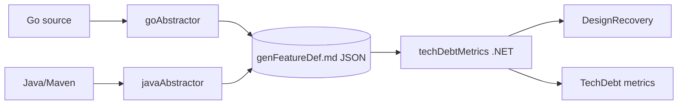

# AGENTS.md — msusel-tdmetrics-go

PhD research pipeline for technical-debt analysis of procedural and OO languages.
This file is the agent's starting map of the repo.

## TL;DR

- Three components, one shared schema:
  - `goAbstractor/` (Go 1.25) and `javaAbstractor/` (Java 17 + Spoon 11.2.0) both emit JSON conforming to **`docs/genFeatureDef.md`**.
  - `techDebtMetrics/` (.NET 8) consumes that JSON to compute design-recovery and technical-debt metrics.
  - Each component is encapsulated such that only one component should be worked
    on at a time (unless otherwise specified by user).
- Researcher controls all changes. Plan first, write only when asked,
  never run `git add` / `git commit` / `git push` / `git stash`. See **Custom Instructions** below.

## Repository Layout

| Path | What lives here |
| --- | --- |
| `goAbstractor/` | Go module. CLI: `main.go`. Library: `internal/abstractor/abstractor.go` (`Abstract(Config) Project`). |
| `javaAbstractor/` | Maven project. CLI: `abstractor.app.App`. Core walk: `abstractor.core.Abstractor` over Spoon's `CtModel`. |
| `techDebtMetrics/` | .NET 8 solution. `Constructs/` mirrors the schema 1:1; `DesignRecovery/` and `TechDebt/` consume it; `Runner/Program.cs` is **currently a `NotImplementedException` stub**. |
| `docs/` | Schema (`genFeatureDef.md`) and design notes (`spoonNotes.md`, `ducktype.md`, `extendingPointers.md`, `participationMatrix.md`, `tdResults.md`). |
| `testData/go/` , `testData/java/` | Integration fixtures with expected `abstraction.yaml` goldens. `testData/java/test10NN` are single-file Tester fixtures; lower numbers are full Maven projects. |
| `.github/workflows/ci.yaml` | CI: Go tests on Linux/Win/macOS + golangci-lint, Java `mvn test`, `dotnet test`. |
| `Makefile` | Aggregates per-component `*-test` and `*-clean` targets. |
| `AGENTS.md` | This file. |

## Component Map

### goAbstractor key entry points

- `goAbstractor/main.go` — CLI (`-i`, `-o`, `-v` verbose, `-m` minimize, `-h`).
- `internal/abstractor/abstractor.go` — `Abstract(Config) constructs.Project`.
  Two-phase: walk (querier + baker + converter + analyzer + instantiator) then
  `resolver.Resolve` (`dce/`, `genInterfaces/`, `inheritance/`, `instantiations/`, `references/`).
- `internal/constructs/` — one folder + `.go` per construct kind.
  `factory.go`, `project/`, `packageCon/`. Includes temp/reference constructs
  (`tempReference`, `tempDeclRef`, `tempTypeParamRef`) used during resolution.
- `internal/jsonify/` — JSON tree builder + minimization.
- `internal/logger/` — push/pop indented logger.

### javaAbstractor key entry points

- `abstractor.app.App` — CLI driver; `prepareMavenProject` → `performAbstraction()` → `Project.toJson(JsonHelper)`.
- `abstractor.core.Abstractor` — Spoon walk + finish (`consolidateCons`, `crossConnectConstructs`, `validate`).
  Queues: `pendingPackages`, `pendingMetrics` (batch drain).
- `abstractor.core.spoonUtils.SpoonUtils` — element descriptions, package paths, JDK shape helpers.
- `abstractor.core.validator.Validator` — post-walk graph checks.
- `abstractor.core.constructs.*` — one class per construct, `Factory<T>` + `Ref<T>`, `Baker` (`anyDesc`, `$Array`, `basicForBoxedOrString`).
- `abstractor.core.json.*` — JSON build/parse/format with `JsonHelper` toggles (`writeKinds`, `writeIndices`, `writeRefs`).

### techDebtMetrics key entry points

- `Runner/Program.cs` — **stub** (`throw new NotImplementedException`).
- `Constructs/Project.cs` — root with `IReadOnlyList<...>` per construct. Implements `IConstruct`, `IKeyResolver`.
- Construct interfaces: `IConstruct`, `IDeclaration`, `IInterface`, `IMethod`, `IObject`, `ITypeDesc`.
- `DesignRecovery/DesignRecovery.cs` — analysis entry; participation/membership computation
  is **mostly commented out** (TODO: synthesised object for basics and projects).
- `TechDebt/{Class,Method,Math,Participation,Project,Source,Validator}.cs` — TD metric computations.
- Tests: `UnitTests/CommonsTests/`, `UnitTests/ConstructTests/`.

## Repo-Specific Conventions

These differ from defaults and matter when writing code:

- **Cross-language pattern mirror**: Java loosely mirrors Go for maintainability — `Factory<T>` + `Ref<T>`,
  `Cmp`/`CmpOptions`, `Jsonable.toJson(JsonHelper)`, `Logger` with push/pop indentation.
  Use the existing pattern even when a more idiomatic per-language one exists.
- **External JDK/library types (Java)**: boxed primitives + `String` → `Baker.basicForBoxedOrString` → shared `Basic`s.
  Shadow types today → `Baker.anyDesc()`; **named stub `InterfaceDecl`s** are target behavior (plan Step 5).
- **Annotations (Java)**: used to inform analysis; do **not** emit them as constructs.
  `CtAnnotationType` → `Logger.notice` + `objectDesc`.
- **Anonymous classes and lambdas (Java)**: fold into the enclosing method's metrics.
  Named nested classes are separate objects with a field named `nest` or similar.
- **Generic instantiations**: tracked as distinct constructs (`ObjectInst`, `MethodInst`, `InterfaceInst`).
- **Package imports**: derive from actual type usage, **not** from `import` statements.
- **Null/unknown (Java)**: `<nulltype>` is a no-op so null-literal usage doesn't create stubs.
  `Analyzer` skips `invokes.add` when `addDeclaration` returns null and skips field reads when `getFieldDeclaration()` is null.
- **Log-and-continue**: never crash on unhandled constructs. TD analysis tolerates imprecision.
- **Spoon fixtures**: avoid `System.out.println` or other STL packages in single-file
  Tester fixtures unless needed or already exists — Spoon will pull large JDK graphs.

## Test Layout (non-obvious bits)

- `testData/go/test0001`–`test0018` and `testData/java/{test0001,test0002,test1001..test1006}`.
  Each fixture pairs source with an `abstraction.yaml` golden (some Go fixtures also carry `expStub.txt`).
- Java tests under `javaAbstractor/src/test/java/abstractor/`:
  - `AppTests` — full-Maven fixtures.
  - `core.Tester` — single-file fixture harness.
  - `core.RobustnessTests`, `core.MetricsTests`, `core.JsonTests`, `core.DiffTests`, `core.IterTests`.
- Run filters: `mvn -Dtest="abstractor.AppTests#test0001" test`, `dotnet test --filter <name>`.

## Custom Instructions

<!-- This section is maintained by developers and describes how agents should perform work.
     It is NOT auto-generated by codebase-summary and MUST be preserved during refreshes.
     Add project-specific conventions, gotchas, and workflow requirements here. -->

This is a PhD research project for technical debt analysis of procedural and
object-oriented languages. The researcher (i.e. user and developer) must remain
in full control of all code changes.

### Git Restrictions

- **NEVER** run `git add`, `git commit`, `git push`, `git checkout`, `git pull`,
  or any other possibly destructive git command.
- Only `git list`, `git fetch`, and `git diff` are permitted.
- Do not create PRs nor branches.

### Interaction Model

- Answers should be short and to the point. When something can be demonstrated
  with a code snippet, use the code snippet to shorten the response.
- Only answer the question directly and do not try to use intuition to guess
  at how the question relates to the project or open files. If the user wants
  you to relate it to the project, they will ask for it.
- Do not guess. When agents guess, the you gets it wrong too often.
  Look up the actual results or label the summary as a guess.

#### When not in ask mode

Follow this strict iterative workflow for every code change:

1. **User tells the agent what to work on.**
2. **Agent returns a plan** for that step WITHOUT changing any code.
3. **User adjusts the plan** as needed.
4. **User asks the agent to write the changes.**
5. **Agent writes the changes and stops** so the user can review.

Never proceed to the next step without the user's explicit direction.

### File-Modification Permissions

- The agent **must ask for permission** before modifying any file.
- The agent must never stage, commit, or push changes; the researcher handles all revision control.

### Code Changes

- Each step should be roughly one feature/fix or a related set of changes.
- Include unit tests alongside code changes (test files in `testData/java/`
  with expected YAML output).
- The user may request an integration test first (with or without expected
  YAML) to understand the "shape of constructs" before implementation.
- Agent may clean up debug artifacts (`println` statements, hardcoded log flags)
  if they are in the way of a change.
- Add TODO comments for features, issues, questions that the user is planning
  on working on. TODO comments are not a request to an agent. The agent may
  use them as a hint but should only try to address them when the user asks.

### Error Handling

- Log warnings and continue; do not crash on unhandled constructs unless continuing
  without handling a construct could cause a bigger problem.
- Since technical debt analysis is estimation interpreted by humans, the
  results can tolerate some imprecision.

### Code Quality

- Follow good practices but do not over-engineer. This is a research tool
  with a finite lifetime, not a long-lived product.
- Code must be debuggable and readable by other researchers.
- Follow existing patterns: `Factory<T>` + `Ref<T>`, `Cmp`/`CmpOptions`,
  `Jsonable` with `toJson(JsonHelper)`, `Logger` with push/pop indentation.
- New patterns are welcome where they make the code cleaner.
- Patterns loosely mirror the Go abstractor (`goAbstractor/`) for
  maintainability across both codebases.

### Key Design Decisions

- External (JDK/library) types: boxed/`String` → `Basic`; named stubs for
  other shadow types (planned — today often `anyDesc`).
- Annotations: use to inform analysis, do not output as constructs.
- Anonymous classes and lambdas: fold into enclosing method metrics.
- Named nested classes: separate objects with `nest` field.
- Generic instantiations: track as distinct types (`ObjectInst`,
  `MethodInst`, `InterfaceInst`).
