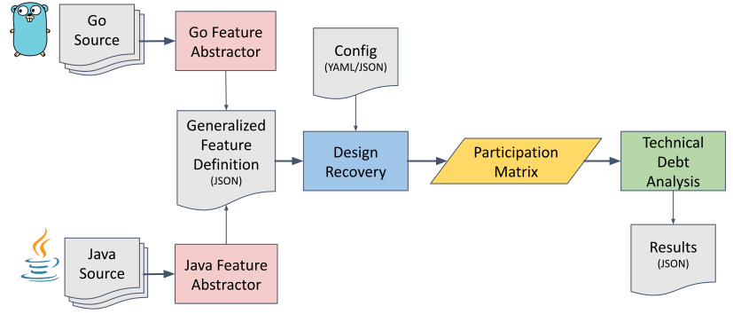

# msusel-tdmetrics-go

The following diagram outlines the pipeline for evaluating technical debt
analysis for procedural and object oriented languages.

1. [Go Feature Abstractor](./goAbstractor/)
2. Java Feature Abstractor
3. Generalized Feature Definition
4. Design Recovery 

## Java Experiments

1. [Participation Measurement with Checkstyle](./javaexps/exp001)
2. [Participation Measurement with Spoon](./javaexps/exp002)
