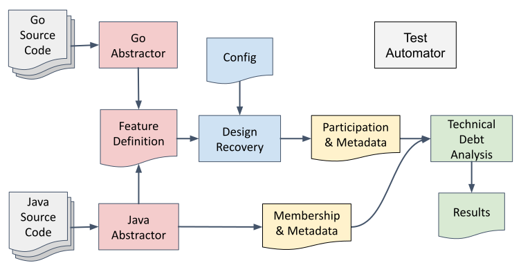

# MSU SECL Technical Debt Analysis of Go

This project is part of [Grant Nelson](https://github.com/Grant-Nelson)'s
Ph.D. research at Montana State University's
[Software Engineering and Cybersecurity Laboratory](https://www.montana.edu/cyber/).

This project defines the pipeline for evaluating technical debt
analysis for procedural and object oriented languages.

1. [Go Feature Abstractor](./goAbstractor/)
2. [Java Feature Abstractor](./javaAbstractor/)
3. [Generalized Feature Definition](./docs/genFeatureDef.md)
4. [TechDebt Metrics](./techDebtMetrics/)
   1. [Design Recovery](./techDebtMetrics/DesignRecovery/)
   2. [Participation Matrix](./docs/participationMatrix.md)
   3. Technical Debt Analysis
   4. [Results](./docs/tdResults.md)
