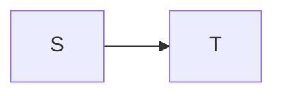
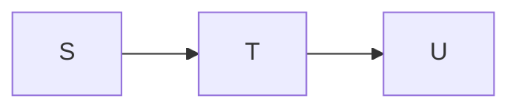
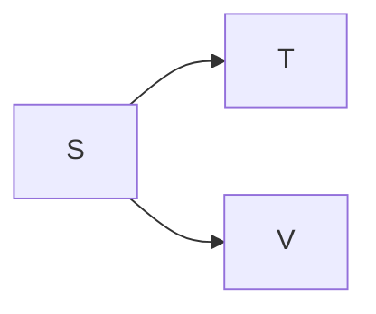
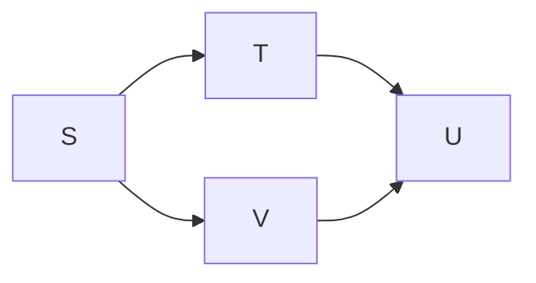

# Duck-Type Hunting

Go uses [duck typing](https://en.wikipedia.org/wiki/Duck_typing).
To be able to do design recovery we need to know how types interact.
We need to be able to determine what are the sub-types and super-types.

Go's type system will determine if
[a type implements another](https://pkg.go.dev/go/types#Implements).
Therefore, part of Go abstraction will require to determine
type relationships for all types to remove duck-typing.

Determining the type relationships brut force is $O(n^2)$ comparisons where $n$
is the number of types. Each type needs to be checked against every other type
(e.g. $\frac{n(n-1)}{2}$) to put all inheritance on each object. Additional
work needs to be done to thin out any inheritance that could be indirect,
i.e. any parent of a parent can be removed from the child since the parent
already contains an indirect inheritance to the grandparent.

Alternatively, a "tree of inheritance" can be used to perform less comparisons
and to create the indirect inheritance at the same time. This is significantly
faster in practice but in worst cases, i.e. no object inheritance another,
is still $O(n^2)$.

## Tree of Inheritance

A tree of inheritance is a directed acyclic graph (DAG) where
the sub-types (see below) are closer to the root and have all super-types as
children nodes. The children nodes in the graph are called "parents" here
since they are inherited from. To simplify the algorithm, the forest of
top most sub-types is put into a root that is considered to be a sub-type
of every type in the tree.

Assuming a type can be represented by a set of members,
the type $S$ is a sub-type of $T$ ( $S <: T$ ) iff the set of
members in each $S \supset T$. In OO terms $S$ inherits $T$,
as in $S$ may be used in anywhere that $T$ maybe used.



If $S \supset T \supset U$, then $S$ inherits $T$ and $T$ inherits $U$.
$S$ inherits $U$ too, in OO this could be defined by the developer,
however with duck typing we assume it is only a transient inheritance
through $T$.



If $S \supset T$, $S \supset V$, and $T \nsupseteq V$,
then $S$ inherits both $T$ and $V$ directly.



Since $T$ and $V$ may overlap, $U$ might be a super-type of both iff
$(T \cap V) \supseteq U$.



## Insert to Tree

1. $N$ is a node, i.e. type, in the tree, $\mathbb{T}$:
    1. $N$ has zero or more parent nodes in the parent set $Np$.
    2. The number of parents is denoted as $|Np|$.
    3. The $i^{th}$ parent is denoted as $N_i$
       where $1 \le i \le |Np|$ and $N_i \in Np$.
    4. The order of the parents doesn't matter.
    5. $\forall N_i \mid N \supset N_i$ meaning all parents of $N$
       are super-types of $N$.
    6. $\forall \left( N_i, N_j \right) \mid i \ne j, N_i \nsupseteq N_j$
       meaning that no parent of $N$ is a super-type of any other parent of $N$.
    7. $N$ is unique such that any other node is either a sub-type or
       super-type of $N$ but not equal to $N$.

2. $R$ is a node that is the root node in the tree:
    1. $R$ is an imaginary type that is considered a sub-type of all types
       such that any parent of $R$ are not a super-type to any other type.
    2. $R$ is used to make a forest of inheritance into a single tree.
    3. When inserting a new node into the tree, the insertion starts
       comparing against $R_i \in Rp$.

3. Inserting a node, $X$, into a node, $Y$:
    1. Initial state: $|Xp| = 0$ and $Y \supset X$.
    2. Assign $A = \{ Y_i \mid X \supset Y_i \}$.
       If $|A| > 0$, then remove $A$ from $Yp$, add $A$ to $Xp$, and
       add $X$ as a parent of $Y$.
    3. For all $Y_i \supset X$, insert $X$ into $Y_i$.
    4. For all $\left( Y_i \cap X \right) \ne \emptyset$ (but not used in
       prior steps), check the subtree for any node that is a super-type.
       Follow branches when there is still an overlap and that overlap
       isn't already super-type of a parent already in $X$.
       1. If overlaps can not be determined by the system, a slower method is
          just to check any subtree not used in a prior step.
       2. These subtrees can't contain sub-types, otherwise the root of the
          subtree would be a sub-type too. However, there may be super-types
          deeper in the subtree.

## Implementation

This algorithm is implemented in
[abstractor/resolver/inheritance](../goAbstractor/internal/abstractor/resolver/inheritance/inheritance.go).

Below is a simplified version in pseudo-code. This assumes that each
set has unique nodes such that no two nodes are equal.

```pseudo
define Node:
   Members used to determine sub-typing
   Parents: Set of Nodes as known direct super-types of this Node

function DetermineInheritance:
   given:
      AllNodes: Set of Nodes
   let:
      TopLevelSiblings: Set of Nodes be empty
   foreach X in AllNodes:
      call AddNode with TopLevelSiblings and X
   discard TopLevelSiblings

function AddNode:
   given:
      Siblings: Set of Nodes
      X: Node
   let:
      AddedToSibling: bool be false
      ParentedSiblings: bool be false
   foreach Yi in Siblings:
      if Yi <: X:
         call AddNode with Yi.Parents and X
         set AddedToSibling to true
      else if Yi :> X:
         add Yi to X.Parents
         remove Yi from Siblings
         set ParentedSiblings to true
      else if Yi overlaps X:
         call SeekParents with Yi.Parents and X
   if ParentedSiblings or not AddedToSibling:
      add X to Siblings

function SeekParents:
   given:
      Siblings: Set of Nodes
      X: Node
   foreach Yi in Siblings:
      if Yi :> X:
         add Yi to X.Parents
      else:
         call SeekParents with Yi.Parents and X
```
