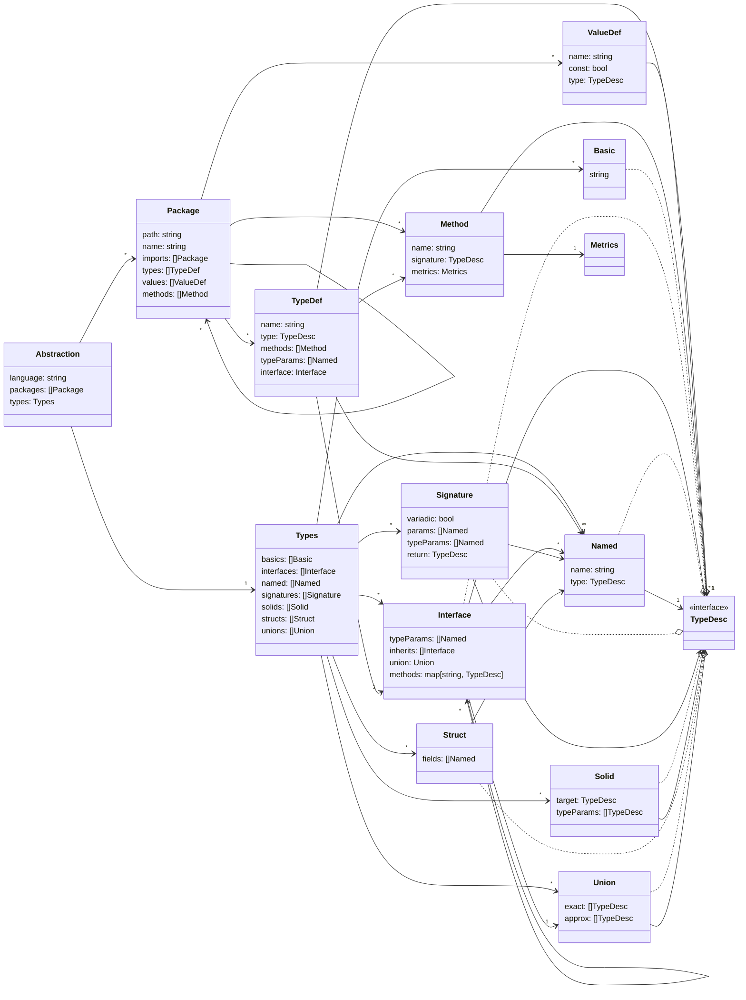

# Generalized Feature Definition

The generalized feature definition is a
[JSON](https://www.json.org/json-en.html) file with specific fields to
define the methods and data of an application. This definition needs to be
flexible enough to handle procedural and object-oriented languages with some
adjustment specific to the language. For example, Go uses duck-typing
but the definition requires a list of specific implementation so the Go
abstractor must perform steps to predetermine which types would duck-type
and define that via implementations.

:notice: Out-of-date

